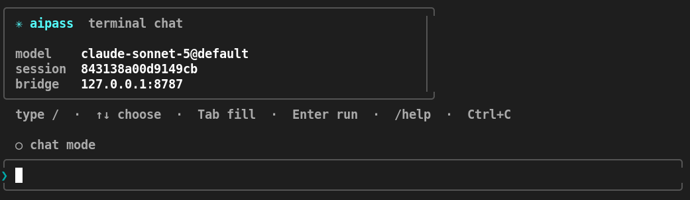

# ✳ aipass

> Use [de.aipass.net](https://de.aipass.net/chat) from your terminal with live streaming, autonomous file editing agent, and an OpenAI-compatible API bridge.

<p align="left">
  = 18" />
  
  
  
</p>



---

## Architecture

```text
terminal / CLI ──HTTP──▶ bridge (node, zero dependencies)
                             │  SSE: jobs out, POST: deltas back
                             ▼
                          extension service worker (MV3) + Offscreen Keepalive
                             │  chrome.runtime
                             ▼
                          de.aipass.net tab ──▶ /actions/send-message/<id>
```

**Zero credentials stored on disk.** Requests run as standard page JavaScript inside your logged-in `de.aipass.net` tab, so Chrome handles cookies natively. The bridge never sees your password or session secrets.

---

## ✨ Features

- 💬 **Interactive Terminal Chat (TUI):**
  - Live token streaming with markdown formatting (headers, lists, tables, code blocks).
  - Immediate 4-sided rounded message card upon prompt submission (`╭─╮`, `│ text │`, `╰─╯`).
  - Braille spinner with thinking elapsed time and inline composer (`Type to queue next message · Esc to stop`).
  - Prompt queueing: type your next message ahead of time and auto-dispatch upon turn completion.
  - Instant stream interruption: press `Esc` or `Ctrl+C` to cleanly abort generation at any moment (`⏹ response stopped by user`).
  - Interactive slash-command menu (`/`) with 5-item pagination, navigation header (`Suggestions (1/13)`), and arrow-key browsing.
  - Bracketed paste mode (pasted multiline text won't accidentally auto-submit).
  - Native Unicode & Thai tone mark width alignment.
  - 📄 **Document & File Attachments (`[file1]`):**
    - Attach documents via `--file <path>` (repeatable, up to 20 MB).
    - Supported formats: PDF (`.pdf`), Word (`.docx`), Excel (`.xlsx`), PowerPoint (`.pptx`), Text (`.txt`, `.md`, `.csv`, `.json`).
    - In-chat slash command `/file <path> [prompt]` or auto-detection when pasting document paths.
  - 🖼️ **Multimodal Image Support (`[image1]`):**
    - Paste images directly from OS clipboard using `Alt+V` (or `Ctrl+V`).
    - Drag-and-drop or paste image paths (`.png`, `.jpg`, `.webp`) — automatically converts to `[image1]`.
    - Slash commands `/clip [prompt]` and `/image <path> [prompt]` for instant attachment.
  - 🧠 **Reasoning Thinking Level (`--thinking` / `/thinking`):**
    - Select thinking depth (`low`, `medium`, `high`, `max`) on reasoning models like Claude 3.7 and Gemini.
  - 🛡️ **Chrome MV3 Offscreen Keepalive:**
    - Dedicated offscreen document ensures the background service worker never sleeps during long tasks.

- 🤖 **Autonomous Coding Agent (`/agent` or `aipass agent`):**
  - Runs in **Chat Mode** or **Agent Mode** directly within the TUI, or as a standalone CLI.
  - Complete local toolset:
    - `NEED dir <path>` / `NEED file <path> [start-end]` (200-line pagination with smart continuation hints)
    - `SEARCH <query>` (recursive text search across project files)
    - `GLOB <pattern>` (path matching like `**/*.tsx` or `src/**/*.mjs`)
    - `GIT <subcommand>` (inspect status, branch, diff, log)
    - `FETCH <url>` (read external web documentation)
    - `WEB <query>` (perform live web searches directly through the model)
    - `CREATE <path>` / `EDIT <path>` / `DELETE <path>` / `MOVE <old> <new>`
    - `RUN` (optional local command execution with `--allow-run`)
  - **In-memory filesystem overlay**: Dry-run by default — preview changes as a colorized unified diff before applying to disk.
  - **Resilient Cloudflare WAF Evasion**: Automatically masks high-risk token patterns (e.g. execution policies, IP addresses, tags, `.env`) and redacts blocked lines on 403 rejections to keep multi-step agent tasks running smoothly.

- 🌐 **Live Web Search Streaming:**
  - Upstream web searches (`[web_search]`) stream their progress and character counts in real-time, accompanied by source citations at the end.

- 🔌 **OpenAI-Compatible Local API:**
  - Serves `POST /v1/chat/completions` and `GET /v1/models` at `http://127.0.0.1:8787/v1`, allowing external tools (like Cursor, Cline, or Python SDK) to talk to `de.aipass.net`.

---

## 🚀 Quick Start (Node ≥ 18)

Everything in `aipass-bridge/` uses Node.js standard libraries (`node:*`). There are **no build steps** and **no dependencies to install** for the CLI and bridge.

### 1. Install `aipass` on your PATH

```bash
# macOS / Linux:
sh aipass-bridge/install.sh

# Windows (PowerShell):
powershell -ExecutionPolicy Bypass -File aipass-bridge\install.ps1
```

*`install.sh` symlinks `aipass` into `~/.local/bin` (or `~/bin`). `install.ps1` runs `npm link`. Both are idempotent.*

### 2. Load the Chrome Extension (One-time)

1. Open Chrome and navigate to `chrome://extensions`
2. Enable **Developer mode** (toggle in the top-right corner)
3. Click **Load unpacked** and select the [`aipass-bridge/extension`](./aipass-bridge/extension) folder

### 3. Open `de.aipass.net`

Log in at [https://de.aipass.net/chat](https://de.aipass.net/chat) and keep the tab open. The extension icon will indicate **connected**.

> [!TIP]
> In Chrome **Settings ➔ Performance**, add `de.aipass.net` to **Always keep these sites active** so Chrome won't freeze background tabs during long generations.

### 4. Start Chatting!

```bash
# Terminal 1: Start the local bridge (foreground with live logs)
aipass dev        # or: npm run dev

# Terminal 2: Launch interactive terminal chat
aipass
```

---

## 💻 CLI Commands & Usage

```bash
# Chatting
aipass                                 # Interactive TUI chat
aipass "Explain quantum computing"     # One-shot question from CLI
aipass --new                           # Start a fresh conversation immediately
aipass "Describe this" --image ./img.png # Send with attached image file

# Agent Tasks
aipass agent "Fix the navbar bug"      # Run autonomous agent on the current directory
aipass agent "Refactor utils" --apply  # Run agent and apply file modifications automatically
aipass agent "Run tests" --allow-run   # Allow shell execution (`RUN` commands)

# Utility & Management
aipass dev                             # Run bridge in foreground (live logs, Ctrl+C to stop)
aipass status                          # Check health of Node, Bridge, and Extension
aipass models                          # List available models (free-credit models marked)
aipass conversations                   # List recent conversations on your account
```

---

## ⌨️ TUI Slash Commands

While in the interactive `aipass` chat, type `/` to open the interactive command palette (navigated in 5-item pages with `↑/↓` or `Tab`):

| Command | Description |
|---|---|
| `/agent` | Toggle between **Chat Mode** and **Autonomous Agent Mode** (or run a single agent task) |
| `/agent-root <dir>` | Change the target directory the agent operates on |
| `/file <path> [prompt]` | Attach a document (PDF, Word, Excel, CSV, text) with optional prompt |
| `/clip [prompt]` | Paste image from OS clipboard with optional prompt (shortcut: `Alt+V`) |
| `/image <path> [prompt]` | Attach local image file with optional prompt |
| `/model` | Open an interactive arrow-key selector to switch AI models |
| `/models` | Print the full list of available models |
| `/thinking` | Open an interactive arrow-key selector to set reasoning thinking level (or `/thinking <level>`) |
| `/conversations` | Open an arrow-key selector to switch between past conversations |
| `/new` | Start a fresh conversation with the next message sent |
| `/clear` | Clear the terminal screen |
| `/help` | Display command help and shortcuts |

---

## 🛠️ Autonomous Agent Tools

When running in agent mode, the model interacts with your workspace using a structured, human-readable action protocol:

| Action | Description |
|---|---|
| `NEED dir <path>` | List files and subdirectories within `<path>` |
| `NEED file <path> [start-end]` | Read file contents with line numbers (e.g. `1-200`, `201-400`) |
| `SEARCH <text>` | Grep across the entire project for symbols, imports, or text |
| `GLOB <pattern>` | Find files matching wildcard glob patterns (e.g. `**/*.json`) |
| `GIT <subcommand>` | Run git commands (e.g. `status`, `diff`, `log -n 5`) |
| `FETCH <url>` | Fetch and inspect external documentation or web content |
| `WEB <query>` | Trigger upstream web search and receive summarized results |
| `CREATE <path> ... END` | Create a new file or overwrite existing content |
| `EDIT <path>`<br>`FIND ... NEW ... END` | Surgical in-place file editing with exact matching |
| `DELETE <path>` | Mark a file for removal in the overlay |
| `MOVE <old> <new>` | Rename or relocate a file |
| `RUN ... END` | Execute shell command (requires `--allow-run`) |
| `DONE <summary>` | Complete the task with a final summary |

---

## 🤖 Recommended: Custom AI Assistant Setup

To give the agent maximum efficiency and prevent tool hallucinations, you can configure a dedicated Assistant once at [de.aipass.net/ai-assistant/new](https://de.aipass.net/ai-assistant/new):

1. **Name:** `Local File Coder`
2. **Model:** `Claude Sonnet 5` (recommended)
3. **Format:** `สนทนา` (Conversational)
4. **Behaviour:** Paste the prompt below:

```text
You help the user work on a code project on their computer. You cannot open the files; the user runs each action you write and pastes the result back. Never say you lack tools or ask them to paste files — just write actions.

Write actions on their own lines, exactly like this:

NEED dir .
NEED file src/app.ts 1-200
SEARCH text to find anywhere in the project
GLOB **/*.ts
GIT status
FETCH https://example.com/docs
EDIT src/app.ts
FIND
the exact current lines
NEW
the replacement
END
CREATE notes.md
file contents
END
DONE one sentence summary when finished

Rules. Write prose in the user's language; keep action lines exactly as shown. Every reply needs an action or DONE. Never ask questions — pick a reasonable reading and begin. SEARCH to find where something is instead of reading every file; read a file before you EDIT it. Line numbers on the left are display only — never put them in FIND, copy the code exactly. Keep shortened hostnames like LCLHST as written. Write DONE only at the end, never with a NEED.
```

---

## 📂 Repository Layout

This monorepo contains two components:

```text
.
├── aipass-bridge/           # The core zero-dependency Node.js bridge & CLI
│   ├── bin/                 # Executable entrypoints (`aipass.mjs`)
│   ├── bridge/              # Local HTTP & SSE server (`server.mjs`)
│   ├── extension/           # Chrome Manifest V3 extension
│   ├── chat.mjs             # Interactive TUI chat client
│   ├── agent.mjs            # Autonomous coding agent loop
│   ├── test/                # Test suite (50 native Node.js tests)
│   ├── README.md            # Detailed bridge documentation
│   └── DOCS.md              # In-depth architectural internals
│
├── app/                     # Optional companion Next.js web application
├── next.config.ts           # Next.js configuration
└── package.json             # Root npm scripts
```

---

## ⚙️ Configuration & Environment Variables

| Variable | Default | Description |
|---|---|---|
| `AIPASS_PORT` | `8787` | Port for the local bridge server |
| `AIPASS_MODEL` | `gemini-3.1-flash-lite` | Default model used when none specified |
| `AIPASS_TOOL_VISIBILITY` | `reasoning` | How tool activities stream: `reasoning`, `text`, or `off` |
| `AIPASS_IDLE_TIMEOUT_MS` | `180000` | Inactivity timeout in ms before resetting stuck streams |
| `AIPASS_CONVERSATION_ID` | *(unset)* | Pin all chat requests to a specific conversation ID |

---

## 🧪 Testing

Run the comprehensive test suite (50 integration and unit tests covering WAF evasion, streaming, tools, pagination, and CLI edge cases):

```bash
npm test
```

## 📄 Credits & License

This project is a fork of the original work by [niawjunior](https://github.com/niawjunior) from **[niawjunior/aipass-bridge](https://github.com/niawjunior/aipass-bridge)**, with enhancements, TUI overhauls, and autonomous tooling by **[Pheem49](https://github.com/Pheem49)**.

Released under the [MIT License](LICENSE).
